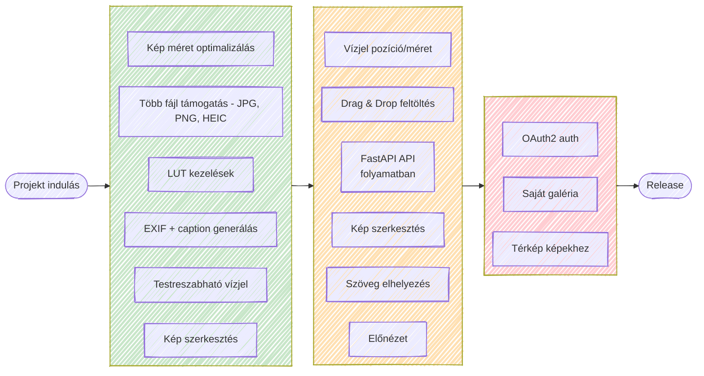
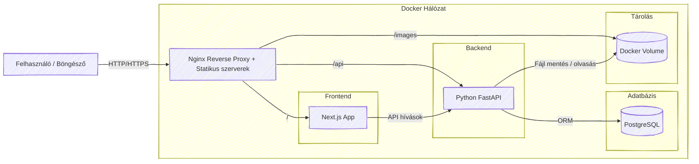

  <h1>ImgPrew</h1>
  
<em>Fotós workflow eszköz: EXIF adatok kinyerése és manipulálása, képszerkesztés és közösségi médiára felkészítés egy helyen.</em>

  

    <a href="#roadmap">Roadmap</a> | 
    <a href="#technológiák">Technológiák</a> | 
    <a href="#közreműködés">Közreműködés</a> |
    <a href="https://github.com/bencso/ImgPrew/tree/develop">Develop branch</a>
  

---

## Vízió

> **Cél:** Egyszerűsíteni a fotósok közösségi média munkafolyamatát anélkül, hogy profi képszerkesztő szoftvert kellene használni.

Az **ImgPrew** lehetővé teszi, hogy a fotósok gyorsan készítsenek *közösségi médiára felkészített* képeket, mindezt egy könnyen kezelhető webes felületen.

**Főbb funkciók:**

* Több fájl támogatás: `JPG`, `PNG`, `HEIC`
* `EXIF` adat kinyerés és caption generálás
* Testreszabható vízjelek és szöveg elhelyezés
* Fényerő, Kontraszt, Saturation, Exposure állítás
* LUT kezelések
* Kép optimalizálás közösségi médiára

<a href="#top">Vissza a tetejére</a>

---

## Technológiák

|     Terület     |                           Technológia                           |                     Miért?                     |
|:---------------:|:---------------------------------------------------------------:|:---------------------------------------------:|
| *Frontend*      |  | Gyors, reszponzív UI komponensek React alapokon |
| *UI library*    |  |  |
| *Backend*       |  | Modern Python REST API, gyors és skálázható     |
| *Architektúra*  |  | Könnyen telepíthető, konténerezett környezet    |

<a href="#top">Vissza a tetejére</a>

---

## Roadmap

**Kiemelet feature táblázat**

| Funkció                                  | Státusz        |
| ---------------------------------------- | -------------- |
| EXIF kinyerés                            | ✅ kész         |
| Caption generálás                        | ✅ kész         |
| Vízjel pozíció/méret                     | ✅ kész         |
| Kép szerkesztés (fényerő/kontraszt/stb.) | ✅ kész         |
| Szöveg elhelyezése a képen               | ⚠️ folyamatban |
| LUT kezelések                            | ⏳ tervezett    |
| Saját galéria                            | ⏳ tervezett    |
| Saját térkép                             | ⏳ tervezett    |
| Authentikáció (OAuth2)                   | ⏳ tervezett    |

<a href="#top">Vissza a tetejére</a>

---

## Architektúra 

> [!NOTE]
> Ez a felépítés még tervezés alatt van, ez csak egy gondolati ábra, így lehet nem a legjobb megoldás....

---

## Közreműködés

A projekt jelenleg **fejlesztés alatt** áll, ezért külső hozzájárulás még nem elérhető.

**Későbbiekben**:

* PR-ek fogadása
* Hibajelentés és feature javaslatok
* `CONTRIBUTING.md` dokumentáció

  

<a href="#top">Vissza a tetejére</a>

