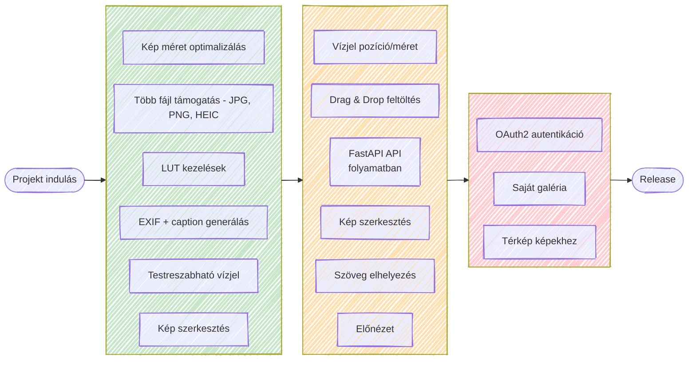
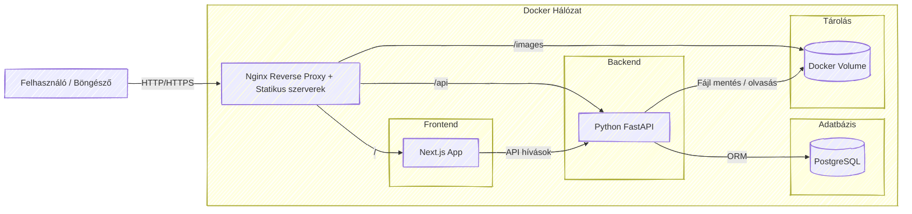

  

  <h2>Gyorsítsd fel a fotós workflow-d!</h2>
  
<em>EXIF adatok kinyerése és manipulálása, képszerkesztés és közösségi médiára felkészítés egy helyen.</em>

  <a href="#technológiák">Technológiák</a> | 
  <a href="#roadmap">Roadmap</a> | 
  <a href="#architektúra">Architektúra</a> |
  <a href="#screenshot">Screenshot</a> |
  <a href="#közreműködés">Közreműködés</a> |

---

## Vízió

> **Cél:** Egyszerűsíteni a fotósok közösségi média munkafolyamatát anélkül, hogy profi képszerkesztő szoftvert kellene használni.

Az **ImgPrew** lehetővé teszi, hogy a fotósok gyorsan készítsenek *közösségi médiára felkészített* képeket, mindezt egy könnyen kezelhető webes felületen.

### Főbb funkciók:

#### Feldolgozás
- JPG, PNG, HEIC támogatás
- EXIF → caption

#### Szerkesztés
- Fényerő / kontraszt / stb.
- LUT

#### Export
- Vízjel
- Szöveg
- Közösségi médiára optimalizálás

<a href="#top">Vissza a tetejére</a>

---

## Technológiák

|     Terület     |                           Technológia                           |                     Miért?                     |
|:---------------:|:---------------------------------------------------------------:|:---------------------------------------------:|
| *Frontend*      |  | Gyors, reszponzív UI komponensek React alapokon |
| *UI library*    |  |  |
| *Backend*       |  | Modern Python REST API, gyors és skálázható     |
| *Architektúra*  |  | Könnyen telepíthető, konténerezett környezet    |

<a href="#top">Vissza a tetejére</a>

---

## Roadmap

**Kiemelt feature táblázat**

| Funkció | Státusz |
|--------|--------|
| EXIF kinyerés | ✅ Kész |
| Caption generálás | ✅ Kész |
| Vízjel | ✅ Kész |
| Szerkesztés | 🟡 Folyamatban |
| LUT | ⬜ Tervezett |

<a href="#top">Vissza a tetejére</a>

---

## Architektúra 

> [!NOTE]
> Ez a felépítés még tervezés alatt van, ez csak egy gondolati ábra, így lehet nem a legjobb megoldás....

<a href="#top">Vissza a tetejére</a>

---

## Screenshot

> [!WARNING]
> **BÉTA verzió (2026.03.21)** – hibák előfordulhatnak!

 

<a href="#top">Vissza a tetejére</a>

---

## Közreműködés

A projekt jelenleg **fejlesztés alatt** áll, ezért külső hozzájárulás még nem elérhető.

**Későbbiekben**:

* PR-ek fogadása
* Hibajelentés és feature javaslatok
* `CONTRIBUTING.md` dokumentáció

  

<a href="#top">Vissza a tetejére</a>

---

  

&nbsp;

&nbsp;

